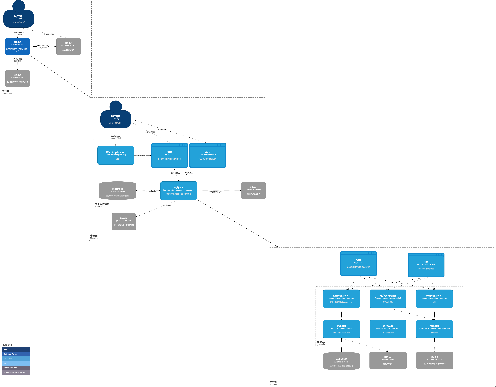
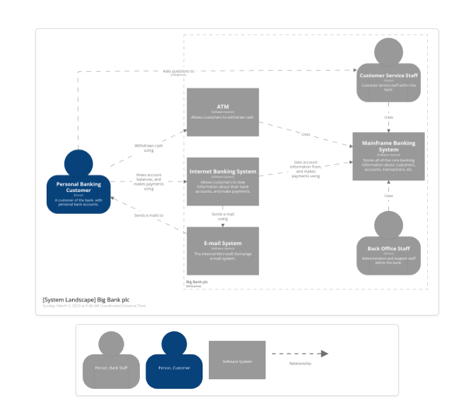
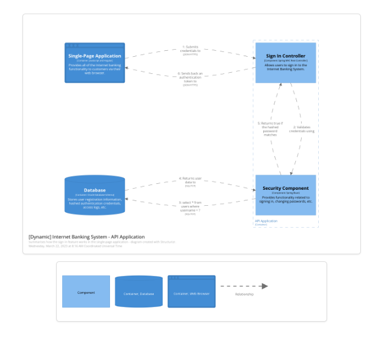

- ## 引子
	- 系统架构图能一目了然的说明我们想表达的概要，弥补了文字描述的苍白无力，然而架构图如何才能完整的表达我们的意愿，使得作者和读者能更好的沟通，却并不简单。
	- 很多设计图没有画出读者的关注点；另外一些设计图画的是一种夹杂，什么都带一下。C4模型提供了一种解决方案，从粗到细的描述一个软件系统。就像在地图上寻找自己的“目的地”一样，从粗到细，先描述“目的地”在哪个国家，再描述目的地所在的省，接着找到市区，最后是目的地的细节。
	- C4构图类似于“金字塔原理”，从小到大，一点点放大、完善我们的想法。
- ## 介绍
- 以下内容参考[C4 modle](https://c4model.com/) 官网
- C4也给出架构图的统一规范。*一致的符号（颜色编码、形状、线条样式等）、命名、关系表达方式、通用术语、技术选择规范、抽象规范等。"统一建模语言（UML）"，"ArchiMate"和"SysML" 这些语言因为较为笨重（复杂）而被开发团队抛弃，转而支持更简单的“框和线”图，然而这些图因为缺乏统一的规范无法在不同团队之间有效的沟通。*
- >创建 C4 模型是为了帮助软件开发团队在前期设计会话和回顾性记录现有代码库期间描述和交流软件体系结构。这是一种以各种细节级别创建代码地图的方法，就像您使用Google地图之类的东西来放大和缩小您感兴趣的区域一样。
- ### 几句话描述C4
- ```
  1. 一组分层抽象（软件系统、容器、组件和代码）
  2. 一组分层图（系统上下文、容器、组件和代码）
  3. 拥有自己特定的符好语言
  ```
- ### C4架构图依次从如下4个维度来说明系统架构
- ```
  1. System Context Diagram(语境图)
  2. Container Diagram(容器图)
  3. Component Diagram(组件图)
  4. code Diagram(实现代码)
  ```
- 1. System Context Diagram
	- C4的语境图，描述目标代码整个交互中涉及的系统，绘制的是与其他系统或者使用者的关系，其他细节不需要在这里体现出来。
- 2. Container Diagram
	- 对“System Context Diagram”中的某个系统进行放大，显示系统的构建块（可以理解为系统内的“应用”）
- 3. Component diagram
	- 组件图，对“Container Diagram”中某一部分放大，显示其构建组件（可以理解为构成某个“应用”的组件）
- 4. code Diagram
	- 实现代码，比如UML class
- 
	-
- C4的其他的视图
	- 系统景观图
		- C4提供的是一个独立的系统视图（条线视图），但是实际上，一个业务模块往往包含很多条条线视图，系统景观图解决了这个层面的问题。
		- 
	- 动态图
		- 基于 UML 通信图，用于展示静态模型中的元素如何在运行时协作以实现用户情景、用例、功能等时
		- 
	- 部署图
		- 部署图是在部署环境上部署应用实例的图，基于UML部署关系图。